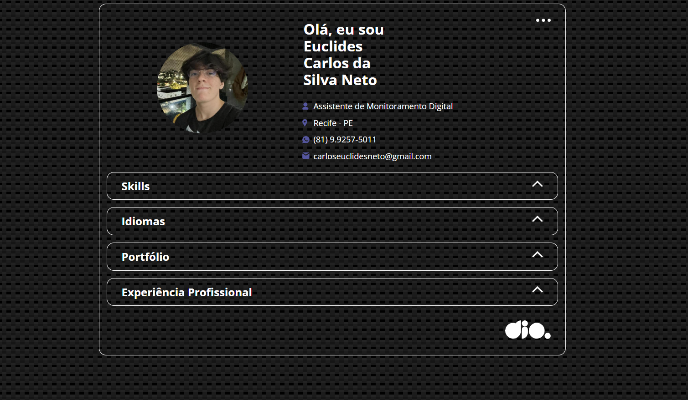
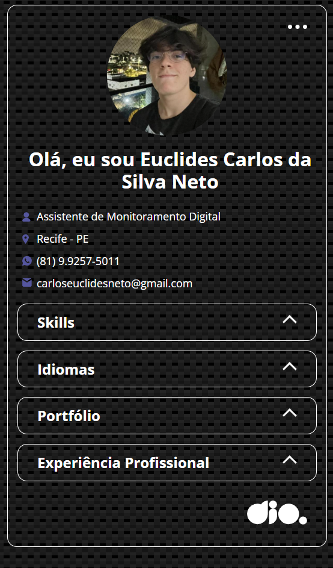

## 👨‍💻 Desafio de Projeto: Portfólio com HTML, CSS e JS
Este projeto de Portfólio com HTML, CSS e JS foi proposto pelo expert Renan Johansen no desafio de projeto da Formação JavaScript Developer da DIO. 
Nesse projeto coloquei minhas informações profissionais e alguns projetos em destaque do meu repositório do GitHUb.

## 💻 Tecnologias usadas

  
  
  

## 🖥 Preview:

Site em um Desktop:

  

 

Site em um dispositivo menor, como por exemplo um celular:

  

## 📌 Créditos
- Acesse os créditos do projeto acessando (criador) [aqui nesse link do GithubPages](https://marcoswinther.github.io/project-portfolio-html-css-js/)
- **Assets:** Disponível no protótipo do Figma disponibilizado no curso.
- **CSS Patterns:** Disponível no site [CSS3 Patterns Gallery](https://projects.verou.me/css3patterns/)
